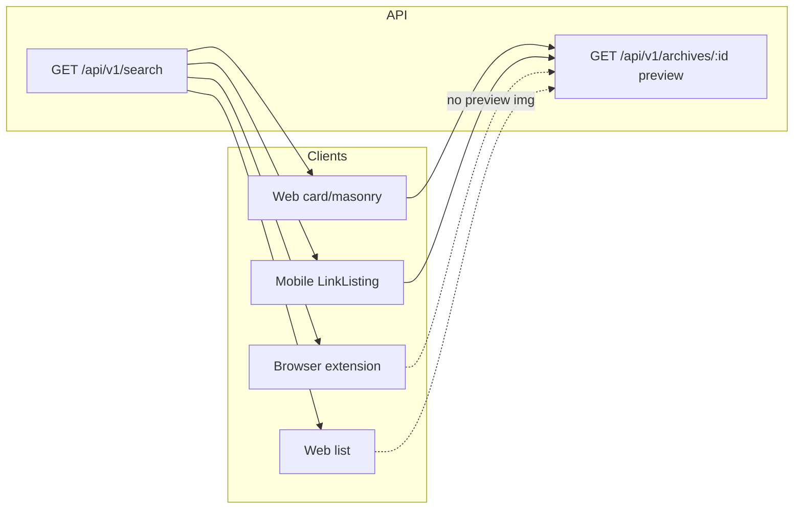

<!-- 4b9b7a29-cf93-483c-8d9d-76546cdd0fef -->
---
todos:
  - id: "lazy-preview-component"
    content: "Add LazyLinkPreview (intersection-gated) and wire into LinkCard + LinkMasonry"
    status: pending
  - id: "optional-omit-media-api"
    content: "Optional: LinkRequestQuery + search route + searchLinks mapping for omitMedia"
    status: pending
  - id: "router-mobile-flag"
    content: "Optional: pass omitMedia from mobile fetch if API added"
    status: pending
  - id: "mobile-defer-preview"
    content: "Optional: defer LinkListing preview Image until row visible"
    status: pending
isProject: false
---
# List view, lazy previews, and extension sync

## Current behavior (this repo)

- **List layout** (`ViewMode.List` in [`apps/web/components/LinkViews/Links.tsx`](apps/web/components/LinkViews/Links.tsx)) renders [`LinkList.tsx`](apps/web/components/LinkViews/LinkComponents/LinkList.tsx), which does **not** show preview thumbnails—only optional favicon-style content via `LinkIcon` when `show.icon` is on.
- **Card / masonry** ([`LinkCard.tsx`](apps/web/components/LinkViews/LinkComponents/LinkCard.tsx), [`LinkMasonry.tsx`](apps/web/components/LinkViews/LinkComponents/LinkMasonry.tsx)) render `next/image` with `src` `/api/v1/archives/${link.id}?format=...&preview=true...`, so each visible card can hit the archives API immediately when the row mounts (not just when it scrolls into view), despite `unoptimized` and default Next lazy behavior for images.
- **Link listing API**: Clients use GET [`/api/v1/search`](apps/web/pages/api/v1/search/index.ts) (see [`packages/router/links.tsx`](packages/router/links.tsx) `useFetchLinks`). [`searchLinks.ts`](apps/web/lib/api/controllers/search/searchLinks.ts) already `omit: { textContent: true }`; `preview` / `image` fields are short path strings—the heavy part is **follow-up** GETs to `/api/v1/archives/...`, not the JSON payload.
- **Mobile** [`apps/mobile/components/LinkListing.tsx`](apps/mobile/components/LinkListing.tsx) always mounts an `Image` for previews when `formatAvailable(link, "preview")`, so lists pull many preview JPEGs at once.
- **Browser extension**: Not in this workspace (see root [`README.md`](README.md)); any “sync without thumbs” behavior there is a separate codebase.

## Recommended implementation (this repo)

### 1. Viewport-gated preview images on web (card + masonry)

- Add a small component (e.g. `LazyLinkPreview`) in [`apps/web/components/LinkViews/LinkComponents/`](apps/web/components/LinkViews/LinkComponents/) that uses **`react-intersection-observer`** (already used in [`Links.tsx`](apps/web/components/LinkViews/Links.tsx)) with `triggerOnce: true` and a modest `rootMargin` (e.g. `200px`) so the preview `<Image>` is not mounted—and the archive URL not requested—until the card is near the viewport.
- Use it inside [`LinkCard.tsx`](apps/web/components/LinkViews/LinkComponents/LinkCard.tsx) and [`LinkMasonry.tsx`](apps/web/components/LinkViews/LinkComponents/LinkMasonry.tsx) in place of the direct `Image` for the preview strip; keep existing skeleton / `unavailable` / `onError` behavior.
- Optionally set `loading="lazy"` on the `Image` for redundancy (native hint on top of intersection gating).

This matches the intent: **thumbnails load while browsing the web UI**, not all at once on first paint.

### 2. Optional: lean search responses for bulk sync (extension / mobile)

If you want clients to **not even receive** `preview` / `image` path hints during bulk sync (so they cannot accidentally prefetch):

- Extend [`LinkRequestQuery`](packages/types/global.ts) with something like `omitMedia?: boolean` (or `listOnly`).
- Parse it in [`apps/web/pages/api/v1/search/index.ts`](apps/web/pages/api/v1/search/index.ts) and pass through to [`searchLinks.ts`](apps/web/lib/api/controllers/search/searchLinks.ts).
- After `findMany`, map links to a response shape that sets `preview` and `image` to `null` when the flag is set (or use Prisma `select`—slightly more invasive because `include` relations must stay consistent with existing types).

Update [`packages/router/links.tsx`](packages/router/links.tsx) `buildQueryString` only if mobile should use the flag; the extension would pass the query param when implemented in its repo.

**Caveat:** Any client that relies on `formatAvailable(link, "preview")` from those fields alone would need to refetch a single link (or archives) before showing a thumb—acceptable for “sync first, thumbs later.”

### 3. Browser extension (out of repo)

- Default **list-style UI** without preview `` during bulk sync.
- Do not call `/api/v1/archives/:id?preview=true` until the user opens a link or explicitly requests a thumbnail.
- Optionally call `/api/v1/search?...&omitMedia=true` once step 2 exists.

### 4. Mobile (optional follow-up)

- Defer preview `Image` in [`LinkListing.tsx`](apps/mobile/components/LinkListing.tsx) until the row is visible (visibility hook, or list virtualization that only mounts images for rendered rows—`FlashList` pattern), aligned with the same “no thumb storm on sync” goal.

## What you already have

- **“List view or no image” on web**: Use **List** view mode and/or turn off **show image** in local settings for card layouts; list rows do not use preview images today.

## Testing

- Web: Open a collection with many links in **card** view; verify Network tab shows archive preview requests only as cards approach the viewport, not for the full list at once.
- If `omitMedia` is added: curl/search with and without the flag and confirm JSON omits or nulls media fields without breaking existing web (web must not send the flag by default).
