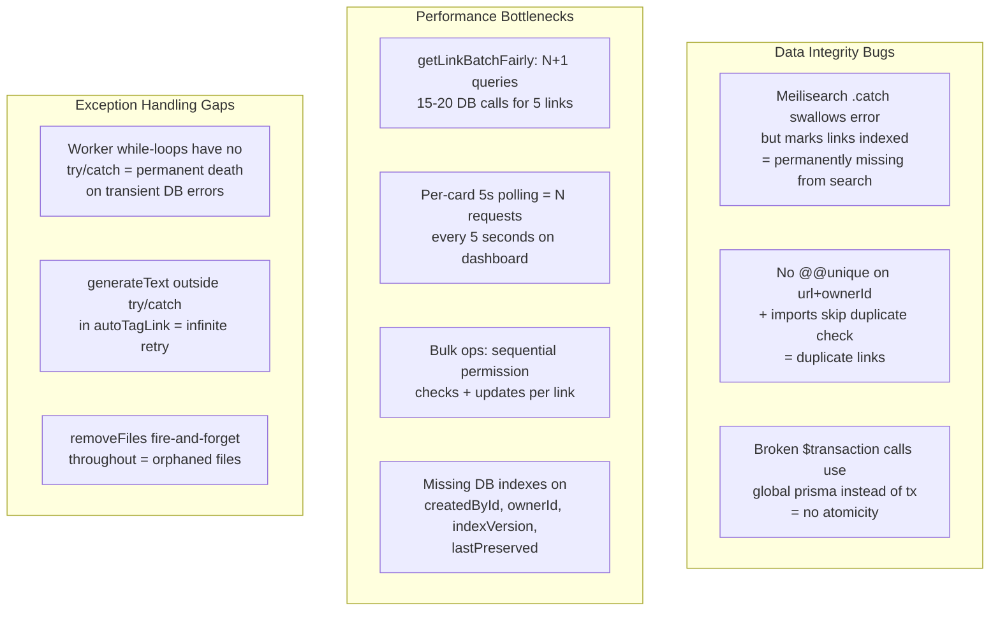

<!-- ada5ddd2-9a50-442b-82ab-479347dd6a1c -->
---
todos:
  - id: "fix-meili-indexing"
    content: "Phase 1.1: Fix Meilisearch indexing bug that permanently loses links from search index"
    status: pending
  - id: "add-unique-constraint"
    content: "Phase 1.2: Add @@unique([url, ownerId]) to Prisma schema + migration"
    status: pending
  - id: "fix-import-duplicates"
    content: "Phase 1.3: Add duplicate checks to all 5 import functions"
    status: pending
  - id: "fix-broken-transactions"
    content: "Phase 1.4: Fix 6 broken $transaction calls to use tx parameter"
    status: pending
  - id: "worker-try-catch"
    content: "Phase 2.1: Add try/catch to linkProcessing and linkIndexing while-loops"
    status: pending
  - id: "fix-autotag"
    content: "Phase 2.2: Fix autoTagLink unhandled error and infinite retry loop"
    status: pending
  - id: "fix-restart-browser"
    content: "Phase 2.3: Fix restartBrowser crash path in linkProcessing"
    status: pending
  - id: "graceful-shutdown"
    content: "Phase 2.4: Add SIGTERM handling and graceful shutdown to workers"
    status: pending
  - id: "add-db-indexes"
    content: "Phase 3.1: Add missing indexes on createdById, ownerId, indexVersion, lastPreserved"
    status: pending
  - id: "rewrite-fair-batch"
    content: "Phase 3.2: Rewrite getLinkBatchFairly to eliminate N+1 queries"
    status: pending
  - id: "fix-link-batch"
    content: "Phase 3.3: Fix getLinkBatch duplicate PrismaClient + O(n^2) dedup"
    status: pending
  - id: "batch-permissions"
    content: "Phase 3.4: Batch permission checks in bulk delete/update controllers"
    status: pending
  - id: "fix-polling-storms"
    content: "Phase 3.5: Replace per-card setInterval polling with single batched refetch"
    status: pending
  - id: "reduce-invalidation"
    content: "Phase 3.6: Replace shotgun invalidation with targeted cache updates in useUpdateLink"
    status: pending
  - id: "fix-archive-response"
    content: "Phase 4.1: Fix response-before-completion in archive endpoint"
    status: pending
  - id: "paginate-admin-archive"
    content: "Phase 4.2: Add pagination to admin archive endpoints that load all links"
    status: pending
  - id: "await-remove-files"
    content: "Phase 4.3: Await removeFiles calls in delete controllers"
    status: pending
  - id: "frontend-error-handling"
    content: "Phase 4.4-4.6: Add HTTP error handling, fix missing await, add input validation"
    status: pending
isProject: false
---
# Link System Robustness Overhaul

## Problem Summary

The review uncovered **3 critical data-integrity bugs**, **6 high-severity performance bottlenecks**, and **10+ exception-handling gaps** across four layers. The most impactful issues:



---

## Phase 1: Critical Data Integrity (prevents duplicate/missing links)

### 1.1 Fix Meilisearch indexing bug (permanently missing links)

In `apps/worker/workers/linkIndexing.ts:126-140`, the `.catch()` on `waitForTask` swallows the error but execution continues to update `indexVersion` in the DB. Links that fail to index are permanently marked as indexed and never retried.

**Fix:** Re-throw after logging, or guard the `updateMany` behind a success check:

```typescript
const task = await meiliClient.index("links").addDocuments(docs);
try {
  await meiliClient.index("links").waitForTask(task.taskUid, {
    timeOutMs: Number(process.env.MEILI_TIMEOUT) || 1000000,
  });
} catch (err) {
  console.error("Error indexing links:", err);
  continue; // skip the indexVersion update, retry next cycle
}

await prisma.link.updateMany({
  where: { id: { in: ids } },
  data: { indexVersion: INDEX_VERSION },
});
```

### 1.2 Add database-level unique constraint for links

In `packages/prisma/schema.prisma`, replace the non-unique index with a partial unique constraint to prevent duplicates at the DB level:

```prisma
@@index([collectionId])
@@unique([url, ownerId]) // replaces @@index([url, ownerId])
```

Note: This requires a migration. URLs that are `null` (non-URL link types) are excluded by PostgreSQL's unique index behavior (nulls are distinct).

### 1.3 Add duplicate checks to all import functions

These files create links without any duplicate checking:
- `apps/web/lib/api/controllers/migration/importFromHTMLFile.ts`
- `apps/web/lib/api/controllers/migration/importFromWallabag.ts`
- `apps/web/lib/api/controllers/migration/importFromPocket.ts`
- `apps/web/lib/api/controllers/migration/importFromOmnivore.ts`
- `apps/web/lib/api/controllers/migration/importFromLinkwarden.ts`

**Fix:** Use `upsert` or `findFirst` + guard before `create` in each import, wrapped in a proper transaction using the `tx` client (not global `prisma`).

### 1.4 Fix broken `$transaction` calls

These files call `prisma.$transaction(async () => {...})` but use the **global** `prisma` client inside the callback instead of accepting a `tx` parameter. This means the operations have **zero atomicity**:

- `apps/web/lib/api/controllers/collections/collectionId/deleteCollectionById.ts:54`
- `apps/web/lib/api/controllers/collections/collectionId/updateCollectionById.ts:67`
- `apps/web/lib/api/controllers/migration/importFromPocket.ts:37`
- `apps/web/lib/api/controllers/migration/importFromWallabag.ts:47`
- `apps/web/lib/api/controllers/migration/importFromOmnivore.ts:40`
- `apps/web/lib/api/controllers/migration/importFromLinkwarden.ts:27`

**Fix:** Change `prisma.$transaction(async () => {` to `prisma.$transaction(async (tx) => {` and replace all `prisma.` calls inside with `tx.`.

---

## Phase 2: Worker Resilience (prevents crashes and stale workers)

### 2.1 Add try/catch to worker while-loops

In `apps/worker/workers/linkProcessing.ts` and `apps/worker/workers/linkIndexing.ts`, the main `while(true)` loops have no try/catch. A single transient DB error permanently kills the worker.

**Fix:** Wrap the loop body in try/catch with logging and continue:

```typescript
while (true) {
  try {
    // existing loop body
  } catch (err) {
    console.error("linkProcessing error, retrying next cycle:", err);
  }
  await delay(interval);
}
```

### 2.2 Fix `autoTagLink.ts` unhandled error + infinite retry

In `apps/worker/lib/autoTagLink.ts:129`, `generateText()` is outside try/catch. If it throws, the link's `aiTagged` stays `false` and is retried every cycle forever.

**Fix:** Wrap `generateText` in try/catch and set `aiTagged = true` after a configurable number of failures to prevent infinite retries.

### 2.3 Fix `restartBrowser` crash path

In `apps/worker/workers/linkProcessing.ts:25`, if `launchBrowser()` throws inside `restartBrowser`, the error escapes and kills the while loop permanently.

**Fix:** Wrap `restartBrowser` internals in try/catch with retry logic.

### 2.4 Add graceful shutdown handling

In `apps/worker/index.ts`, only `SIGINT` is handled. Docker sends `SIGTERM`. Add `SIGTERM` handling and forward the signal to the child process. In `apps/worker/worker.ts`, add signal handlers to close the browser and drain in-flight operations.

---

## Phase 3: Performance (N+1 queries, missing indexes, polling storms)

### 3.1 Add missing database indexes

In `packages/prisma/schema.prisma`, add to the Link model:

```prisma
@@index([createdById])
@@index([ownerId])
@@index([indexVersion])
@@index([lastPreserved])
```

### 3.2 Rewrite `getLinkBatchFairly.ts` to eliminate N+1

Current implementation: 1 user query + N count queries + N*R link queries = 15-20+ queries for 5 links.

**Fix:** Replace the per-user loop with a single query using `GROUP BY` via `prisma.$queryRaw` or a window function, then a single `findMany` with `{ id: { in: pickedIds } }`.

### 3.3 Fix `getLinkBatch.ts` extra PrismaClient + O(n^2) dedup

- Replace `new PrismaClient()` with the shared singleton from `@linkwarden/prisma`
- Replace `.filter()` + `.findIndex()` dedup with a `Set`

### 3.4 Batch bulk operation permission checks

In `apps/web/lib/api/controllers/links/bulk/deleteLinksById.ts` and `updateLinks.ts`, replace per-link `getPermission` loops with a single query:

```typescript
const links = await prisma.link.findMany({
  where: { id: { in: linkIds } },
  include: { collection: { include: { members: true } } },
});
// check permissions in-memory
```

### 3.5 Fix frontend polling storms

In `apps/web/components/DashboardLinks.tsx:110-130` and `apps/web/components/LinkViews/Links.tsx:405-425`, each card starts an independent 5s poll and the list view adds another. With 10 pending links, this generates 10+ API calls every 5 seconds.

**Fix:** Replace per-card `setInterval` with a single batched polling mechanism. Use React Query's built-in `refetchInterval` on the list query (not per-card), and add a max-retry count or exponential backoff:

```typescript
const { data } = useInfiniteQuery({
  queryKey: ["links", params],
  queryFn: fetchLinks,
  refetchInterval: hasPendingPreviews ? 5000 : false,
});
```

Remove the individual `setInterval` from `DashboardLinks.tsx` and `Links.tsx`.

### 3.6 Reduce shotgun invalidation on link update

In `packages/router/links.tsx:195-203`, `useUpdateLink` invalidates 6 query families. Replace with targeted `setQueriesData` for the "links" cache (like `useDeleteLink` already does) and only invalidate what actually changed.

---

## Phase 4: Exception Handling Hardening

### 4.1 Fix response-before-completion in archive endpoint

In `apps/web/pages/api/v1/links/archive/index.ts:60`, `res.status(200)` is sent before the async loop processes links. Move the response after the work completes, or use a job-queue pattern.

### 4.2 Add pagination to admin archive endpoints

Lines 95, 126, 158 in the same file load ALL url-type links into memory. Add batched processing with `take`/`skip` or cursor pagination.

### 4.3 Await `removeFiles` calls

In `deleteLinkById.ts:28` and `deleteLinksById.ts:47`, `removeFiles` is fire-and-forget. Add `await` and error handling.

### 4.4 Add HTTP error handling to frontend fetch calls

In `packages/router/links.tsx:78-93` (`useFetchLinks`), add `if (!response.ok)` checks before parsing JSON.

### 4.5 Fix `useUpdateFile` missing `await`

In `packages/router/links.tsx:480`, `res.json()` is not awaited. Add `await`.

### 4.6 Add input validation to route handlers

In `apps/web/pages/api/v1/links/index.ts`, validate `req.body.links`, `req.body.linkIds`, and numeric query params before passing to controllers. Return 400 for invalid input and 405 for unsupported methods.
